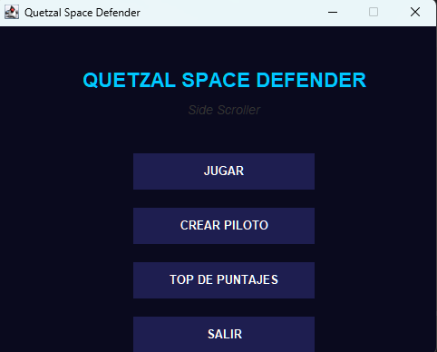
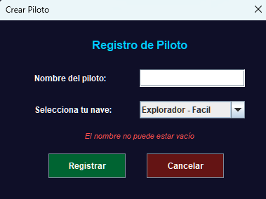
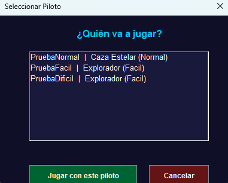
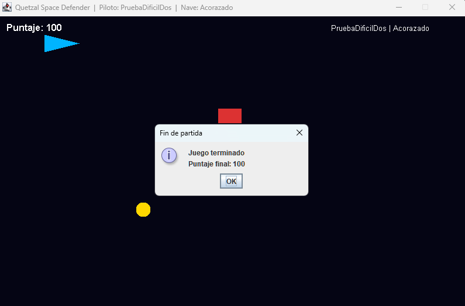
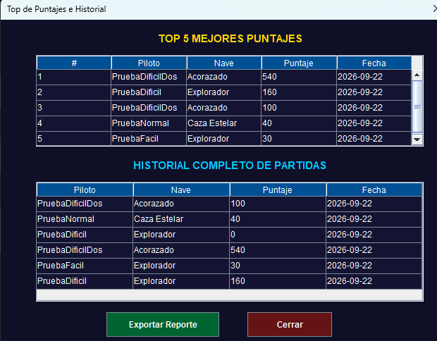
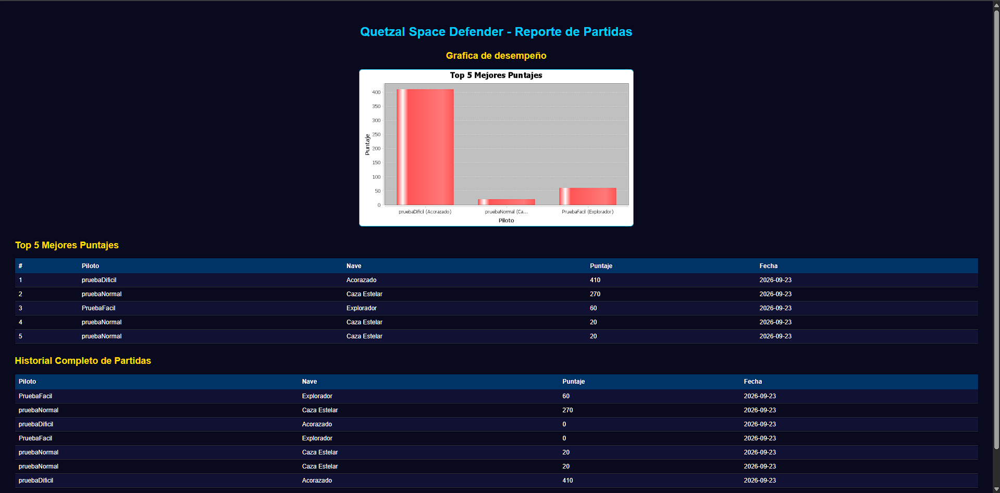

# Manual de Usuario - Quetzal Space Defender

## 1. Descripción

Quetzal Space Defender es un juego tipo Side Scroller en el cual el jugador controla una nave espacial, evita enemigos, recoge objetos especiales y busca obtener el mayor puntaje posible.

El programa permite:

- crear pilotos;
- seleccionar una nave y dificultad;
- jugar partidas;
- consultar el Top 5 de puntajes;
- consultar el historial completo de partidas;
- exportar un reporte con gráfica;
- conservar pilotos y partidas mediante persistencia.

---

## 2. Menú principal

Al iniciar el programa se muestra el menú principal con las siguientes opciones:

- `JUGAR`
- `CREAR PILOTO`
- `TOP DE PUNTAJES`
- `SALIR`

### Vista del menú principal



### Opciones

**JUGAR:** permite seleccionar un piloto registrado e iniciar una partida.

**CREAR PILOTO:** permite registrar un nuevo piloto y seleccionar su nave.

**TOP DE PUNTAJES:** muestra los cinco mejores puntajes y el historial completo de partidas.

**SALIR:** cierra el programa después de solicitar confirmación.

---

## 3. Crear un piloto

Antes de jugar es necesario registrar al menos un piloto.

Para crear un piloto:

1. Presionar `CREAR PILOTO`.
2. Escribir el nombre del piloto.
3. Seleccionar una nave.
4. Presionar `Registrar`.

### Validaciones del nombre

El nombre:

- no puede estar vacío;
- únicamente puede contener letras y espacios;
- no puede estar repetido.

Si el registro es correcto aparecerá:

```text
¡Piloto registrado con éxito!
```

Si el nombre ya existe aparecerá:

```text
Ya existe un piloto con ese nombre.
```
### Ejemplo de registro de piloto



---

## 4. Naves disponibles

Existen tres tipos de nave.

### 4.1. Explorador

**Dificultad:** Fácil

Características:

- alta velocidad de movimiento;
- disparo automático cada 2 segundos;
- enemigos más lentos;
- menor frecuencia de aparición de enemigos.

### 4.2. Caza Estelar

**Dificultad:** Normal

Características:

- velocidad de movimiento intermedia;
- disparo automático cada 1 segundo;
- velocidad de enemigos intermedia;
- frecuencia de aparición intermedia.

### 4.3. Acorazado

**Dificultad:** Difícil

Características:

- baja velocidad de movimiento;
- disparo automático cada 0.3 segundos;
- enemigos más rápidos;
- mayor frecuencia de aparición de enemigos.

---

## 5. Iniciar una partida

Para comenzar una partida:

1. Presionar `JUGAR`.
2. Seleccionar uno de los pilotos registrados.
3. Presionar `Jugar con este piloto`.

Se abrirá la ventana del juego.

En la parte superior se muestra:

- puntaje actual;
- nombre del piloto;
- nave seleccionada.

Si todavía no existe ningún piloto registrado y se presiona `JUGAR`, el sistema mostrará:

```text
Debes crear un piloto antes de jugar.
```
### Selección de piloto



---

## 6. Controles

La nave se mueve verticalmente.

### Subir

Se puede utilizar:

```text
W
```

o:

```text
Flecha Arriba
```

### Bajar

Se puede utilizar:

```text
S
```

o:

```text
Flecha Abajo
```

La nave no puede salir de los límites superior e inferior de la pantalla.

---

## 7. Disparos

Los disparos son automáticos.

El jugador no necesita presionar ninguna tecla para disparar.

La frecuencia depende de la nave seleccionada:

| Nave | Tiempo entre disparos |
|---|---:|
| Explorador | 2 segundos |
| Caza Estelar | 1 segundo |
| Acorazado | 0.3 segundos |

Los proyectiles avanzan desde la nave hacia el lado derecho de la pantalla.

---

## 8. Enemigos

Los enemigos aparecen desde el lado derecho de la pantalla y se desplazan hacia la izquierda.

Si un proyectil impacta un enemigo:

```text
+20 puntos
```

El enemigo es eliminado.

Si la nave del jugador colisiona con un enemigo, la partida termina.

---

## 9. Objetos especiales

Durante una partida pueden aparecer tres tipos de objetos especiales.

### 9.1. Snitch Espacial

Se representa con color dorado.

Efectos:

- suma 150 puntos;
- destruye todos los enemigos visibles.

### 9.2. Bludger

Se representa con color gris.

Efecto:

- reduce temporalmente la velocidad de movimiento del jugador durante 2 segundos.

Mientras el efecto está activo aparece en pantalla:

```text
RALENTIZADO
```

### 9.3. Quaffle

Se representa con color naranja.

Efecto:

```text
+10 puntos
```

---

## 10. Fin de partida

La partida termina cuando la nave del jugador colisiona con un enemigo.

El sistema mostrará una ventana con:

```text
Juego terminado
Puntaje final: ...
```

Al presionar `OK`:

1. se guarda la partida;
2. se actualiza el historial;
3. se cierra la ventana del juego;
4. el usuario vuelve al menú principal.

### Ejemplo de fin de partida



---

## 11. Cerrar una partida manualmente

La ventana del juego también puede cerrarse mediante la `X`.

En este caso:

- se detienen los hilos de la partida;
- se cierra la ventana;
- la partida abandonada no se registra como partida finalizada.

---

## 12. Top de Puntajes

Desde el menú principal presionar:

```text
TOP DE PUNTAJES
```

Se mostrará una ventana dividida en dos secciones.

### 12.1. Top 5 Mejores Puntajes

Muestra únicamente los cinco puntajes más altos registrados.

Los resultados aparecen ordenados de mayor a menor.

Se muestra:

- posición;
- piloto;
- nave;
- puntaje;
- fecha.

### 12.2. Historial Completo de Partidas

Muestra todas las partidas finalizadas.

Para cada partida se muestra:

- piloto;
- nave;
- puntaje;
- fecha.

### Ejemplo de Top de Puntajes e Historial



---

## 13. Exportar reporte

Dentro de la ventana de Top de Puntajes se encuentra el botón:

```text
Exportar Reporte
```

Para generar el reporte:

1. Presionar `Exportar Reporte`.
2. Esperar a que finalice la generación.
3. El sistema mostrará el mensaje:

```text
Reporte exportado correctamente.
```

4. El reporte HTML se abrirá automáticamente en el navegador predeterminado.

El reporte contiene:

- gráfica de desempeño;
- Top 5 de mejores puntajes;
- historial completo de partidas.

Durante la exportación se generan:

```text
reporte_quetzal.html
reporte_grafica.png
```

### Ejemplo de reporte exportado



---

## 14. Persistencia

El sistema conserva automáticamente la información después de cerrar el programa.

Se almacenan:

- pilotos registrados;
- historial de partidas.

Al volver a ejecutar el programa:

- los pilotos registrados continúan disponibles;
- el historial se recupera;
- el Top 5 se reconstruye utilizando las partidas guardadas.

---

## 15. Archivos de persistencia

El programa utiliza los archivos:

```text
pilotos.txt
partidas.txt
```

### pilotos.txt

Almacena la información de los pilotos registrados.

### partidas.txt

Almacena las partidas finalizadas.

Estos archivos son administrados automáticamente por el programa y no es necesario modificarlos manualmente.

---

## 16. Salir del programa

Desde el menú principal presionar:

```text
SALIR
```

El sistema mostrará una ventana solicitando confirmación.

Si se selecciona `Sí`, el programa se cerrará.

---

## 17. Resumen de controles

| Acción | Control |
|---|---|
| Subir | `W` o `Flecha Arriba` |
| Bajar | `S` o `Flecha Abajo` |
| Disparar | Automático |

---

## 18. Ejecución mediante JAR

El repositorio incluye el archivo ejecutable:

```text
dist/Practica2.jar
```

Para ejecutar el programa:

1. Tener Java instalado.
2. Descargar o clonar el repositorio.
3. Abrir una terminal en la carpeta raíz.
4. Ejecutar:

```bash
java -jar dist/Practica2.jar
```

5. Se mostrará el menú principal de Quetzal Space Defender.
